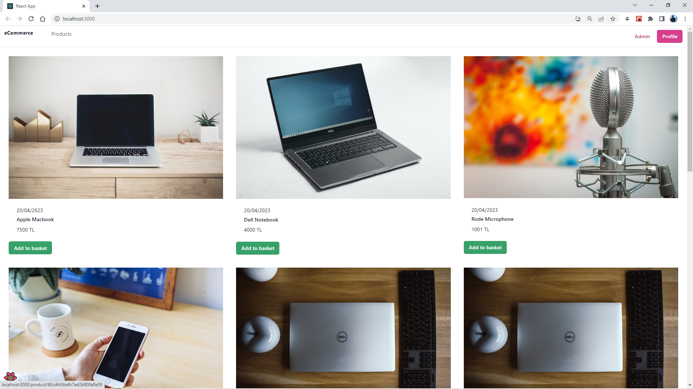
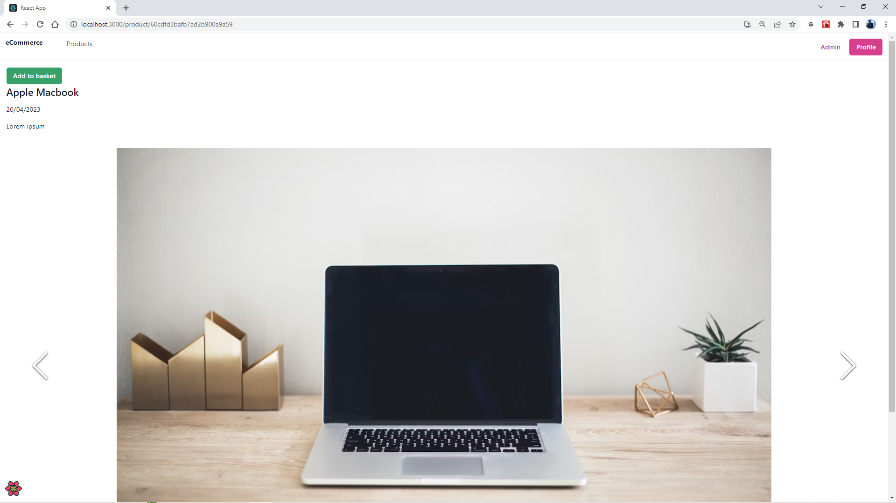
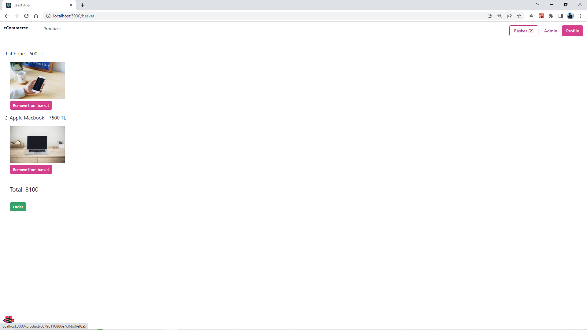
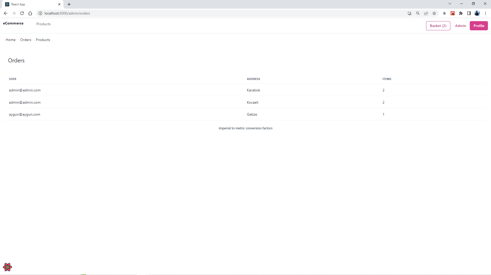
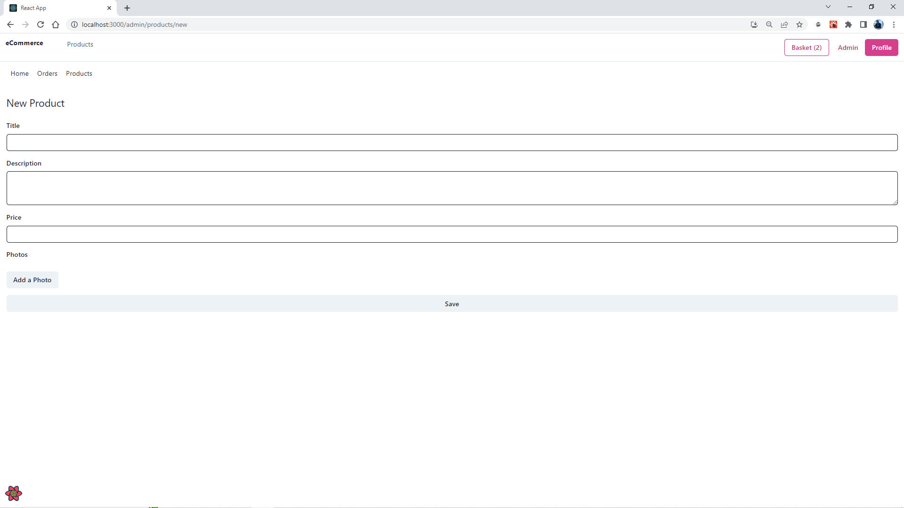

# E-Commerce App

I have developed this project by following [Patika.dev React Course](https://academy.patika.dev/courses/react)

I have not developed this project by myself. Thanks to Instructor @meseven

I learnt some technologies during this development process.

## Technologies Used In Project

- React, Context Api
- React Router v6
- React Query (Tanstack Query)
- Chakra UI, Ant Design
- Formik, Yup
- Axios

## Screenshots

### Products



### Product Details



### Cart



### Admin Panel: Orders



### Admin Panel: Products


### Admin Panel: New Product



## Getting Started

You can download [backend here](https://drive.google.com/drive/folders/16y0EP1FsGxiaGFArTsxxYNyYYO7upATM?usp=sharing)

Redis must be installed on your computer, if you are using Windows you can install Redis on WSL

[Install Redis on Windows](https://redis.io/docs/getting-started/installation/install-redis-on-windows/)

Instead you can use [Redis Cloud](https://redis.com/redis-enterprise-cloud/overview/) or other cloud solutions you want,

MongoDB must be installed on your computer

[MongoDB Compass](https://www.mongodb.com/products/compass)

Create database `test`

Create collections `products`, `orders`, `users`

Create .env file on root directory, example above:

```
MONGO_URI=mongodb://127.0.0.1:27017
JWT_SECRET=ENTER_YOUR_SECRET
JWT_REFRESH_SECRET=ENTER_YOUR_REFRESH_SECRET
```

Install packages for backend

```
cd backend
npm install
```

Start backend

```
npm run dev
```

Install packages for client

```
cd e-commerce
npm install
```

Start client

```
npm start
```
